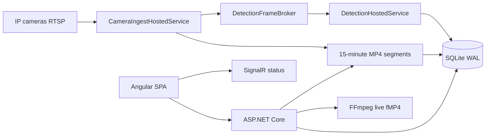

# Architecture

Nidus Vision is a self-hosted NVR: one ASP.NET Core host, an Angular SPA, SQLite, FFmpeg for RTSP ingest, and ONNX person detection.

## Runtime shape



In production Docker, the Angular build is copied into `wwwroot` and served from the same process as the API. In local development the API runs on port **6438** and `ng serve` on **4200** proxies `/api`, `/health`, and `/hubs`.

## Projects

| Project | Role |
|---|---|
| `src/NidusVision.Web` | ASP.NET Core host: HTTP APIs, SignalR, hosted workers, SPA fallback |
| `src/NidusVision.Client` | Angular 21 SPA (monitor, recordings, cameras, settings) |
| `src/NidusVision.Core` | Entities, options, timeline merge, retention planner, RTSP helpers |
| `src/NidusVision.Data` | EF Core SQLite, migrations, retention worker |
| `src/NidusVision.Streaming` | FFmpeg process wrappers (ingest, probe, live) |
| `src/NidusVision.Inference` | ONNX person detector, YOLO decode, execution-provider selection |
| `tests/NidusVision.Tests` | xUnit: timeline, retention, ROI, YOLO, reconnect, recordings |

`NidusVision.Web` references Core, Data, Streaming, and Inference. ONNX Runtime native packages are mutually exclusive; the provider is chosen at build time via `OnnxRuntimeProvider`.

## Data

SQLite file: `{Storage:DataDirectory}/{Storage:DatabaseFileName}` (default `data/nidus.db`), WAL + `busy_timeout=5000`. Camera password keys live in `{Storage:DataDirectory}/keys` so they stay with the data volume across container recreates.

| Entity | Purpose |
|---|---|
| `Camera` | Name, location, RTSP URLs, credentials, transport, last probe stats |
| `RecordingSegment` | MP4 path, time range, size, human flag, thumbnail, finalized |
| `DetectionInterval` | Presence window with confidence and optional boxes |
| `AppSettings` | Retention days, storage cap, inference on/off, sample FPS, threshold |
| `LocalUser` | Single admin password hash |

Recordings live under `{Storage:RecordingsDirectory}/{cameraId}/` as time-stamped MP4s. Default segment length is 900 seconds (`Storage:SegmentDurationSeconds`).

On startup the host migrates the database, resets camera status to offline, and deletes leftover files from the retired events directory if `Storage:EventsDirectory` is still configured.

## HTTP and realtime

Cookie auth after first-visit password setup (`POST /api/auth/...`). Endpoints:

- `/health`
- `/api/cameras`, `/api/settings`
- Live MSE stream (`MapLiveEndpoints`)
- Timeline + recording library (`MapTimelineEndpoints`, `MapRecordingEndpoints`)
- SignalR `/hubs/status` for camera online/recording/offline

When `wwwroot` exists (Docker / published SPA), static files and `index.html` fallback are enabled.

The SPA routes: `/login`, `/monitor`, `/recordings`, `/cameras`, `/settings`.

## Ingest and live

`CameraIngestHostedService` polls enabled cameras and keeps one FFmpeg run per camera. A fingerprint of URL, credentials, transport, and sample-FPS restarts the process when those change.

Each run:

1. Probes the RTSP URL.
2. Records a pass-through MP4 segment (copy, no re-encode when possible).
3. Optionally samples low-FPS RGB frames from the **same** RTSP connection and publishes them to `DetectionFrameBroker`.

Reconnect uses exponential backoff. Live view is a separate FFmpeg process producing fMP4 for Media Source Extensions in the browser.

Camera RTSP URLs must be reachable from the process (container). Use a LAN IP, not `127.0.0.1`. Streams on the Docker host can use `host.docker.internal`.

## Detection

`DetectionHostedService` drains the frame broker on a short timer so a slow model cannot stall capture.

- Model file: `models/person.onnx`, or `NIDUS_PERSON_MODEL`.
- Decode: YOLO-style boxes, letterbox inverse, confidence threshold from settings.
- `DetectionPresenceTracker` opens/closes `DetectionInterval` rows instead of writing one row per frame.
- Segments can be marked `HasHuman` when intervals overlap them.

### ONNX execution providers

Providers are compile-time exclusive (`OnnxRuntimeProvider`):

| Value | Typical use |
|---|---|
| `DirectML` | Windows local default, then CPU |
| `OpenVino` | Docker / Intel iGPU via `/dev/dri`, then CPU |
| `Cuda` | NVIDIA GPU, then CPU |
| `Cpu` | CPU only |

`OnnxExecutionPlanner` tries GPU+CPU, then CPU. Missing `/dev/dri` skips the OpenVINO GPU attempt.

Docker copies OpenVINO native libs from a Python ONNX Runtime OpenVINO wheel into the ASP.NET image.

## Background work besides ingest

- `ThumbnailWorker` + `VideoThumbnailExtractor` — JPEG thumbs for segments
- `RetentionWorker` — applies `RetentionPlanner` (age + optional max bytes; detection-tagged footage kept longer)

## Docker

`docker/Dockerfile` builds the Angular SPA, publishes the web project with `OnnxRuntimeProvider=OpenVino`, installs FFmpeg, and listens on **6438**. Compose maps `/dev/dri` and `video`/`render` GIDs (`44`/`109` — match the host with `ls -l /dev/dri`). Volumes: `nidus-data`, `nidus-recordings`. `nidus-events` is a one-upgrade mount for deleting old event clips.

## Local development

Requires .NET 10 SDK, Node.js 22+, and FFmpeg on `PATH` or `FFMPEG_PATH`.

```bash
dotnet tool restore
dotnet run --project src/NidusVision.Web
```

```bash
cd src/NidusVision.Client
npm install
npm start
```

API: http://localhost:6438. UI: http://localhost:4200.

```bash
dotnet test NidusVision.slnx
dotnet run --project src/NidusVision.Web
# Windows default: DirectML then CPU

dotnet test NidusVision.slnx -p:OnnxRuntimeProvider=Cpu
dotnet publish src/NidusVision.Web/NidusVision.Web.csproj -c Release -p:OnnxRuntimeProvider=OpenVino
dotnet publish src/NidusVision.Web/NidusVision.Web.csproj -c Release -p:OnnxRuntimeProvider=Cuda
dotnet publish src/NidusVision.Web/NidusVision.Web.csproj -c Release -p:OnnxRuntimeProvider=DirectML
```

CI (`.github/workflows/ci.yml`) builds and tests the solution, builds the Angular app, and builds the Docker image without pushing.
